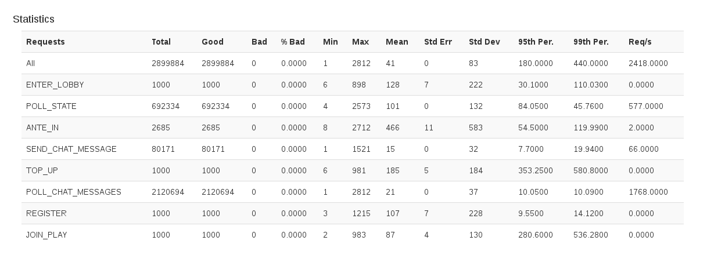

# Machinery

Machinery is a data processing library.  The idea is to be able to setup operations you want to perform on data and then be able to feed data into those operations based on drill-down levels.  I originally developed it when I was dealing with the problem of generating the statistics section of a performance testing tool I was working on.  You can see a screenshot below.  Note that the same operations are performed for each line, and that the 'All' line processes all the data from all the other lines.

You can see the tests for examples:

[I'm a relative reference to a repository file](./src/test/java/uk/co/malbec/machinery/BasicExamples.java)

At this point you will be wondering why not just use java 8 Streams?  I used them when I first developed this code, and I was very unhappy with how clear the code was.  

Consider this excerpt from the tests.  Assume we have sales data for houses and we want to compute the total number of houses sold grouped by borough and by type.  Using Streams would be difficult.  

    public void calculate_number_of_houses_by_borough_and_type() {
        CategoryGroup<String, CategoryGroup<String, Scalar<BigInteger>>> categoryGroup = dynamicCategorization(() -> dynamicCategorization(() -> scalar(ZERO)));

        Consumer<House> processor = partitionBy(House::getBorough, String::equals, categoryGroup,
                partitionBy(House::getType, String::equals, categoryGroup::current,
                        operation(() -> categoryGroup.current().current(), BigInteger::add, ONE, () -> categoryGroup.current().current())
                )
        );

        houseSales.forEach(processor::accept);

        assertThat(categoryGroup.get("Hillingdon").get("Flat").getValue().intValue(), is(1));
        assertThat(categoryGroup.get("Newham").get("Flat").getValue().intValue(), is(3));
    }

The usage has this general structure.
 * We define a data structure to collect all relevant data.
 * We defined the processes that will operate on the data we feed in, and that will aggregate into the data structure we first defined.
 * We feed in the data.
 * We use the data.

Each CategoryGroup object splits the data according to some rule.  The rule you can see in the processing section; getBorough and getType.  Also each grouping is dynamic, which means it will expand dyamically as data is supplied.    At the bottom of the structure we have a Scalar which is just a single number, in this case a BigInteger and in the processing section you can see that we are adding one each time.

